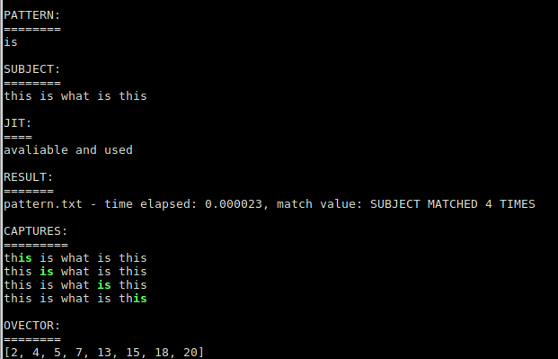

# msc_retest

Welcome to the `msc_retest` documentation.

Description
===========

This tool compiles two binaries: `pcre4msc2` and `pcre4msc3`. The binaries emulates the behaviors of regex engine (PCRE - the old version) in mod_security2 (Apache module) and the libmodsecurity3. With this programs, you can check the evaulation time and result of every regular expressions with any random (including very extreme long) input. Both of them (regex pattern, input subject) needs to exists in two separated files, and you can pass them as argument. Subject can be passed through stdin, if you give '-' for subjectfile, eg:

```bash
echo "arg=../../../etc/passwd&foo=var" | src/pcre4msc2 regexes/930110_1.txt -
regexes/930110_1.txt - time elapsed: 0.000012, match value: SUBJECT MATCHED 1 TIME
```
or just simple leave it:

```bash
echo "arg=../../../etc/passwd&foo=var" | src/pcre4msc3 regexes/930110_1.txt
regexes/930110_1.txt - time elapsed: 0.000006, match value: SUBJECT MATCHED 1 TIME
```

The source tree contains some extra directories: under the `data/` you can find all of the regular expressions, what CRS uses. The files contains the id of the rule, and a suffix (there are some chained rules, where more parts uses `@rx`).

The `utils/` directory contains a python tool, which helps to re-generate the regexes above. It uses `msc_pyparser` - for more information, see the README.md in that directory.

Useful information
==================

There are so many difference between mod_security2 and libmodsecurity3 implementations:

Parsing:
--------

* mod_security2 is an Apache module, so it uses the avaliable functions, including parsing of configuration files. Apache config parser strips the extra `\` (backslash) characters and escaped " if it is inside of quoted string. Eg. if the rule in the config contains a substring like `\\\\'`, then it will evaluated as `\\'`, if there is a pattern `\"` in a quoted string, then it will be `"`.
* libmodsecurity3 uses an own parser, and it doesn't make any strip methods. But it does if the rule defined in the configuration file of the webserver.

This mean if the rule readed from the external file (like CRS), that will not be stripped, but if there is an inline rule (see [this](https://github.com/SpiderLabs/ModSecurity-nginx#modsecurity_rules)), then it will.

This strip function is implemented in `pcre4msc2` code itself.

pcre_study(), JIT
-----------------

* mod_security2 module uses `pcre_study()` if it's avaliable, but **you can disable** it (with `--enable-pcre-study=no`)
* mod_security2 module uses `PCRE_JIT` if it's avaliable **and you enabled it in build time** (with `--enable-pcre-jit`)
* libmodsecurity3 uses `pcre_study()` by default, and you **can't disable** it
* libmodsecurity3 uses `PCRE_JIT` if it supported by the pcre library, **there isn't any option** to tune the engine

limit match, limit match recursion
----------------------------------

* mod_security2 module uses the `PCRE_EXTRA_MATCH_LIMIT` and `PCRE_EXTRA_MATCH_LIMIT_RECURSION` (see this on same page) flags; if you don't set them befure you build the source, the default values will be 1500
* you can overwrite these values with `--enable-pcre-match-limit=N` and `--enable-pcre-match-limit-recursion=N`
* you can disable these features with `--enable-pcre-match-limit=no` and `--enable-pcre-match-limit-recursion=no`
* libmodsecurity3 doesn't supports these features at all

Here you can find more information about [pcre_study](https://www.pcre.org/original/doc/html/pcre_study.html), and [pcrejit](https://www.pcre.org/original/doc/html/pcrejit.html#SEC1). Also you can find some useful information about recursion limits [here](https://www.pcre.org/original/doc/html/pcreapi.html).

Capture patterns with OVECTOR
-----------------------------

If `pcre_exec()` matches a regular expression against a given subject string, then it collects the subpatterns. The offsets values will stored in a vector of integers - this is the OVECTOR. It's very important, that the length if this vector must be divide by 3 (the correct values could be multiple of 3). It's important how long of this vector, this value determines the number of possible subpatterns.

Both versions uses a precompiled value, mod_security2 uses 30, libmodsecurity3 uses 900. You can change these values only if you modify the source and recompile it again.

These informations are very important to understand, why and how works the tools.

Other notes - outdated
----------------------

The libmodsecurity3 `@rx` implementation had some design errors (which are now [fixed](https://github.com/SpiderLabs/ModSecurity/pull/2348)): the `searchAll()` method (which is same here as the original code) always collected the captured substrings from subject - this could be make slower the operator. The another thing was there was no limit: if the subject contained the pattern (for example) 100 times, then it collected all of them, so this could be lead to high memory usage (of course it depends on pattern and subject - but the collection will stores only the first 10 matches: from TX.0 to TX.9). Another problem was that this method was used for many other places, not just the `@rx` operator, eg. variables, transformations... `pcre4msc3` contains the fixed version, but you can allow the old method with `-f` argument. This argument works only with `pcre4msc3` tool.

In case of mod_security2, the engine doesn't collects all matches, only the first one.

Here is a small summary, how can you check:

 * create a rule, for eg. in the `REQUEST-901-INITIALIZATION.conf`:
   ```
   SecRule ARGS|ARGS_NAMES "@rx (?:is)" \
     "id:800003,\
     phase:2,\
     t:none,\
     pass,\
     capture,\
     msg:'%{TX.0}, %{TX.1}, %{TX.2}, %{TX.3}, %{TX.4}, %{TX.5}, %{TX.6}, %{TX.7}, %{TX.8}, %{TX.9}'"

   ```
 * send a request to the HTTP server:
   ```
   curl -v 'http://localhost/?foo=this%20is%20what%20is%20this
   ```
   note, the argument `foo` contains the value 'this is what is this', and the pattern in the rule is 'is'. The number of expected values is 4.

Let's see the logs:
 * Apache (mod_security2):
   ```
   ModSecurity: Warning. Pattern match "(?:is)" at ARGS:foo. [file "/usr/share/modsecurity-crs/rules/REQUEST-901-INITIALIZATION.conf"] [line "456"] [id "800003"] [msg "is, , , , , , , , , "] [hostname "localhost"] [uri "/"] [unique_id "XonUavaOEga8L3onA0ZYBAAAAAA"]
   ```
 * Nginx (libmodsecurity3 - before the [fix](https://github.com/SpiderLabs/ModSecurity/pull/2348)):
   ```
   ModSecurity: Warning. Matched "Operator `Rx' with parameter `(?:is)' against variable `ARGS:foo' (Value: `this is what is this' ) [file "/usr/share/modsecurity-crs/rules/REQUEST-901-INITIALIZATION.conf"] [line "447"] [id "800003"] [rev ""] [msg "is, is, is, is, , , , , , "] [data ""] [severity "0"] [ver ""] [maturity "0"] [accuracy "0"] [hostname "0.0.0.0"] [uri "/"] [unique_id "158609110136.080640"] [ref "o2,2o5,2o13,2o18,2v10,20"], client: ::1, server: _, request: "GET /?foo=this%20is%20what%20is%20this HTTP/1.1", host: "localhost"
   ```

As you can see, the `libmodsecurity3` produced the expected result, `mod_security2` doesn't. Try to increase the number if "is" patterns in your query, eg:

```
curl -v 'http://localhost/?foo=this%20is%20what%20is%20this%20is%20is%20is...%20is'
```
and check the `modsec_debug.log`. As you can see the result is what I described above, `libmodsecurity3` old version collects all occurrence of matches:
```
Added regex subexpression TX.0: is
Added regex subexpression TX.1: is
Added regex subexpression TX.2: is
Added regex subexpression TX.3: is
Added regex subexpression TX.4: is
Added regex subexpression TX.5: is
Added regex subexpression TX.6: is
Added regex subexpression TX.7: is
Added regex subexpression TX.8: is
Added regex subexpression TX.9: is
Added regex subexpression TX.10: is
Added regex subexpression TX.11: is
Added regex subexpression TX.12: is
```
but only the first 10 has logged. In case of `mod_security2`, you will see only one line:
```
Added regex subexpression to TX.0: is
```

Requirements
============

To compile the code you need the pcre library (eg. `libpcre3-dev` package on Debian - this is the old version), and the autotools.

Build
=====

Download and unpack the source, and

```
autoreconf --install
./configure
make
```

Use
===

A quick how to:

```bash
echo "this is what is this" > subject.txt
echo "(?:is)" > pattern.txt
src/pcre4msc2 pattern.txt subject.txt
pattern.txt - time elapsed: 0.000013, match value: SUBJECT MATCHED 1 TIME
```

This means the subject doesn't matches with the regex, and the time taken 0.000009 sec (9 ms).

You can check the exit status of program:
```bash
echo $?
0
```

Now check the elapsed time in the output - that's a very important value. That shows you how long the regex engine runs. You can pass an argument to check that this time below your limit or not. For this, try to run:

```bash
src/pcre4msc2 -t 0.000001 pattern.txt subject.txt
pattern.txt - time elapsed: 0.000013, match value: SUBJECT MATCHED 1 TIME
echo $?
1
```

As you can see, the time limit (argument of `-t`) is 0.000001 second (1 ms), it's less than the running time. If this is greater than your limit, the exit codes will 1. Try it again with a greater value:

```bash
src/pcre4msc2 -t 0.0001 pattern.txt subject.txt
pattern.txt - time elapsed: 0.000013, match value: SUBJECT MATCHED 1 TIME
echo $?
0
```

`src/pcre4msc3` works as same way.

Extra options
-------------

Based on the [information](#Useful%20information':ignore') above, now let's see the possible options for the tools.

 
| option | parameter needed | meaning          |  pcre4msc2 |    pcre4msc3 |
|-------:|-----------------:|-----------------:|-----------:|-------------:|
|   `-j` | no               | use jit          |     supported | not supported |
|   `-s` | no               | ignore study     |     supported | not supported |
|   `-n` | yes              | number of runs   |     supported |     supported |
|   `-m` | yes              | mathch limit     |     supported | not supported |
|   `-r` | yes              | match lim. rec.  |     supported | not supported |
|   `-t` | yes              | exec. time lim.  |     supported |     supported |
|   `-d` | no               | show details     |     supported |     supported |
|   `-f` | no               | force alt. meth. | not supported |     supported |

and `-h` of course.

Examples
--------

Here are some examples:

(Note, that I assumed you have a file with the content for subject.)

**Run a tests with all used regular expression with a pattern.**

```bash
for d in `ls -1 regexes/9*.txt`; do src/pcre4msc2 ${d} /path/to/subject.txt; done
```

**Same test but filter the rules with extra long times.**

```bash
for d in `ls -1 regexes/9*.txt`; do src/pcre4msc2 ${d} /path/to/subject.txt; done | grep "\([1-9][0-9]\|[1-9]\)\.[0-9]"
```

**Same tests but run it for libmodsecurity3 'engine'.**

```bash
for d in `ls -1 regexes/9*.txt`; do src/pcre4msc3 ${d} /path/to/subject.txt; done
```

**Use the filter here too.**

```bash
for d in `ls -1 regexes/9*.txt`; do src/pcre4msc3 ${d} /path/to/subject.txt; done | grep "\([1-9][0-9]\|[1-9]\)\.[0-9]"
```

**Collect regexes where the runtime over your limit (0.00001 sec)**

```bash
for d in `ls -1 regexes/9*.txt`; do src/pcre4msc2 -t 0.00001 -j ${d} /path/to/subject.txt; if [ $? -ne 0 ]; then echo "Time limit exceeded: ${d}"; fi; done | grep "Time limit"
```

**Same tests but use JIT.**

```bash
for d in `ls -1 regexes/9*.txt`; do src/pcre4msc2 -j ${d} /path/to/subject.txt; done
```

**Check again and compare the long times with 2nd exampe.**

```bash
for d in `ls -1 regexes/9*.txt`; do src/pcre4msc2 -j ${d} /path/to/subject.txt; done | grep "\([1-9][0-9]\|[1-9]\)\.[0-9]"
```

Note, see the difference in case of some patterns - it's awesome performance increase.

**Run a test N times**
```bash
src/pcre4msc3 -n 5 path/to/pattern path/to/subject
```

**Change the match and/or recursion limit**
```bash
src/pcre4msc2 -m 4000 -r 4000 path/to/pattern path/to/subject
```

[See the difference between the modsec_v2 **without** JIT, modsec v2 **with** JIT, modsec v3, and old modsec v3 matches algorithm](#diff-between-methods)
```bash
echo "this is what is this" > subject.txt
echo "(?:is)" > pattern.txt
# v2
src/pcre4msc2 pattern.txt subject.txt
pattern.txt - time elapsed: 0.000015, match value: SUBJECT MATCHED 1 TIME
# v2 with JIT
src/pcre4msc2 -j pattern.txt subject.txt
pattern.txt - time elapsed: 0.000007, match value: SUBJECT MATCHED 1 TIME
# v3 original
src/pcre4msc3 pattern.txt subject.txt
pattern.txt - time elapsed: 0.000014, match value: SUBJECT MATCHED 4 TIMES
# v3 modified
src/pcre4msc3 -f pattern.txt subject.txt
pattern.txt - time elapsed: 0.000010, match value: SUBJECT MATCHED 1 TIME
```

Of course, for a more precision result you have to run the tests with `-n 10`, or with more sophisticated pattern and subject.

**Show the details with created files above (pattern.txt, subject.txt)***
```bash
src/pcre4msc2 -d pattern.txt subject.txt

RAW pattern:
============
is

ESCAPED pattern:
================
is

SUBJECT:
========
this is what is this

JIT:
====
available but disabled

STUDY:
======
enabled

MATCH LIMIT:
============
1000

MATCH LIMIT RECURSION:
======================
1000

RESULT:
=======
pattern.txt - time elapsed: 0.000019, match value: SUBJECT MATCHED 1 TIME

CAPTURES:
=========
th*is* is what is this

OVECTOR:
========
[2, 4]

```

where the firs is printed with green color.

**Show the details with pattern what contains escape***
```bash
echo "\"//onerror=\"" > subject2.txt
src/pcre4msc2 -d regexes/941120_1.txt subject2.txt

RAW pattern:
============
(?i)[\s\"'`;\/0-9=\x0B\x09\x0C\x3B\x2C\x28\x3B]+on[a-zA-Z]+[\s\x0B\x09\x0C\x3B\x2C\x28\x3B]*?=

ESCAPED pattern:
================
(?i)[\s"'`;\/0-9=\x0B\x09\x0C\x3B\x2C\x28\x3B]+on[a-zA-Z]+[\s\x0B\x09\x0C\x3B\x2C\x28\x3B]*?=

SUBJECT:
========
"//onerror="

JIT:
====
available but disabled

STUDY:
======
enabled

MATCH LIMIT:
============
1000

MATCH LIMIT RECURSION:
======================
1000

RESULT:
=======
regexes/941120_1.txt - time elapsed: 0.000015, match value: SUBJECT MATCHED 1 TIME

CAPTURES:
=========
*"//onerror=*"

OVECTOR:
========
[0, 11]

```

As you can see, the escaped pattern is shorter than the original.

Note, the substring between the two asterisks is also higlighted.

**See the detailed output from the previous example with pcre4msc3**
```bash
src/pcre4msc3 -d pattern.txt subject.txt

PATTERN:
========
is

SUBJECT:
========
this is what is this

JIT:
====
avaliable and used

RESULT:
=======
pattern.txt - time elapsed: 0.000015, match value: SUBJECT MATCHED 4 TIMES

CAPTURES:
=========
th*is* is what is this
this *is* what is this
this is what *is* this
this is what is th*is*

OVECTOR:
========
[2, 4, 5, 7, 13, 15, 18, 20]

```
As you can see, the ModSecurity3 pattern matching code founds the all occurance of substring. Note, that this isn't the escaped pattern part, because this engine doesn't do that. Match limit and match limit recursion also doesn't exists, because they aren't used.

See the screenshot:

